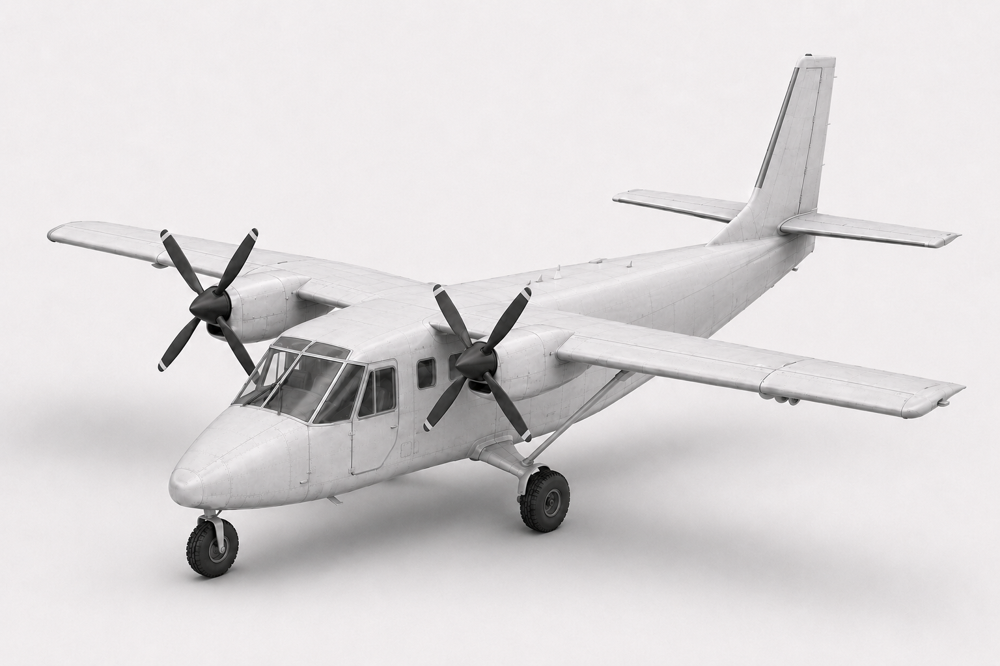

# Tyche R2-T1 — STOL Aircraft Analysis and Validation

Engineering analysis and validation archive for the Tyche R2-T1
hybrid-electric short take-off and landing aircraft developed for the
Royal Aeronautical Society International Light Aircraft Design
Competition 2025–26.

## Released Configuration

- Aircraft: Tyche R2-T1
- Geometry: G1.3
- Fuselage length: 10.750 m
- Wing area: 30.000 m²
- Wing span: 16.400 m
- Propellers: 2 × 2.00 m
- Mass/structural release: S1.0
- Aerodynamic production model: G5
- Numerical authority: CVR-1.0

## Analysis Campaign

| Release | Analysis |
|---|---|
| G1.3 | Released OpenVSP geometry |
| PDT | Parasite drag build-up |
| CA-G0–G3 | Clean aerodynamic campaign |
| G5 | Stability and control derivatives |
| SM6.3B / SM6.4 | CG and static-margin closure |
| VMC7.1–7.3 | Powered engine-out solver investigation |
| VMC7.4 | Analytical engine-out equilibrium |
| FG8.0–FG8.4 | Forward-CG control and gear closure |

## Repository Purpose

This repository preserves the analysis inputs, raw solver outputs,
processed results, scripts, engineering calculations and validation
evidence supporting the Tyche R2-T1 design.

## Status

The repository contains conceptual-design engineering analyses.
Results must be interpreted with the qualifications and limitations
identified in the Controlled Values Register and Analysis Evidence Log.

## Important Design Limitations

Tyche R2-T1 is a conceptual design and does not constitute a
certificated aircraft.

The final controlled design does not close the complete specified
payload mission within the 2,000 kg MTOM. Additional limitations and
validation boundaries are documented in CVR-1.0.
